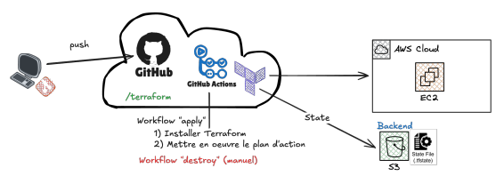

# terraformAWSLab6

## To do

### Base Project

- [x] VPC (Subnets, availability zones)
- [x] Internet Gateway
- [x] Nat Gateway
- [x] Web server (create, sg, user data)
- [x] Route table to internet
- [x] Route table private subnet to nat gateway
- [x] RDS Primary (create and sg)
- [ ] RDS Secondary (Not possible with student account)


### Workflow GitHub Actions

- [x] Github actions workflow who create all ressource in terraform files -> [terraformApply.yml](.github/workflows/terraformApply.yml)
- [x] Github actions workflow who destroy all ressource in terraform state -> [terraformDestroy.yml](.github/workflows/terraformDestroy.yml)
- [x] S3 bucket stocks the `terraform.tfstate`



## Secrets

Create GitHub Secrets in Settings -> Secrets and variables -> Actions -> New repository secret

- AWS Credentials (In AWS details)
  - AWS_ACCESS_KEY_ID
  - AWS_REGION
  - AWS_SECRET_ACCESS_KEY
  - AWS_SESSION_TOKEN

- AWS RDS DB (You can choose)
  - DB_PASSWORD
  - DB_USERNAME
  
- AWS SSH key for ec2 instance Web server
  - Generate SSH key: `ssh-keygen -t rsa -b 4096 -f web-server-key`
  - SSH_PUBLIC_KEY

- AWS S3 BUCKET (You can choose)
  - S3_BACKEND_BUCKET

## Project Structure

```bash
.
├── .github
│   └── workflows
│       ├── terraformApply.yml
│       └── terraformDestroy.yml
├── data.tf
├── main.tf
├── outputs.tf
├── terraform.tfvars
└── variables.tf
```

- terraformApply.yml: Workflow that automatically applies Terraform configuration and creates all AWS resources
- terraformDestroy.yml: Workflow that automatically destroys all AWS resources managed by Terraform state
- data.tf: defines data sources used by Terraform (AMIs)
- main.tf: declares primary resources (networking, instances, SGs, routes)
- variables.tf: declares input variables (types, default values)
- terraform.tfvars: provides concrete values for variables (CIDRs, sizes, names)
- outputs.tf: exposes outputs printed after running `terraform apply`(Subnets and VPC IDs and clickable link to web server)
- terraform.tfstate: Terraform state (Do not modify)

## Commands

### Terraform

- `terraform init` - Initializes a Terraform working directory and downloads required provider plugins
- `terraform fmt` - Formats Terraform configuration files to standard style
- `terraform fmt -check` - Checks if files are properly formatted without modifying them
- `terraform validate` - Validates the syntax and configuration of Terraform files
- `terraform plan` - Shows what changes Terraform will make to your infrastructure
- `terraform apply` - Applies the planned changes and creates or updates resources
- `terraform destroy` - remove all the resources defined in Terraform configuration

### SSH

- `ssh -i web-server-key ec2-user@<Public_DNS>`
